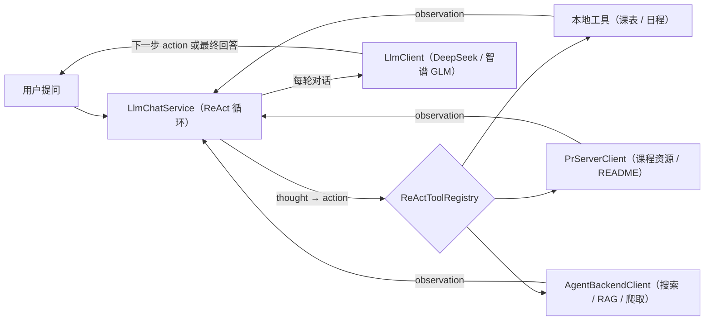

<h1 align="center">HITA</h1>

  
  
  
  
  

[App 下载（Releases）](https://github.com/HIT-A/HITA_Android/releases/latest) | 最新版本 v2.7.1

## 项目背景
项目最初来自哈尔滨工业大学（深圳）2018 级本科生大一年度立项，原名 HITSZ 助手，重构版改名为 HITA。
现支持三校区（深圳/本部/威海），并集成 AI 助手功能。

## 应用简介
这是面向哈尔滨工业大学三校区学生的工具类 APP（非官方）。

### 当前主要功能
- **课表与日程**：导入课表、按周查看、课程详情、自定义壁纸；冲突时段合并显示为"课程冲突"卡片，有 18:30 后的课程时给出"还有更多课程"提示；教务刷新会保留账号隔离的版本快照，可随时恢复；支持 ICS 课表导入/导出
- **教务服务**：成绩查询、学分绩与排名、空教室查询、深圳全校课表浏览；可关注教学班并同步到时间表、今日页和小组件；另提供学分统计与学习进度、培养方案完成度、成绩分析
- **选课助手**：深圳选课池浏览、智能推荐与本地选课预览；草稿支持冲突提示和课表投影，不会自动提交选课
- **课程资源**：应用内搜索课程资料与 README、支持追加型投稿
- **教师搜索**：优先使用课程资源数据，同时提供教师主页检索入口
- **考试**：三校区教务考试查询（考试列表/详情、一键导入课表），另提供考试备忘录
- **AI 助手**：基于 ReAct 框架的智能问答，支持课程查询、教师搜索、课表查询、评价提交等功能；支持多会话管理、附件解析（PDF/Office/TXT 本地解析，图片/视频多模态）与自定义 API Key
- **提醒通知**：上课前 15 分钟课程提醒、新成绩提醒，可在设置中开关
- **实用网址**：校内常用网址分组（教学/事务/网络/资源），点按打开或长按复制
- **公告与更新**：服务/故障/版本公告与关键公告弹窗；应用内检查更新、下载安装与历史版本
- **账号体系**：注册/登录 HITA 账号，管理头像、昵称、个性签名等资料，支持本地数据迁移
- **主题与字体**：多套界面风格与配套字体，侧边栏一键切换并刷新小组件；支持深色模式

## AI 助手功能说明

### 支持的智能工具
AI 助手基于 ReAct 框架，支持以下工具调用：

1. **课表查询** (`get_timetable`) - 查询今日/明日/任意日期的课程安排
2. **添加日程** (`add_activity`) - 添加日历提醒
3. **空教室查询** (`search_empty_classroom`) - 查询本地缓存的空教室
4. **本地课表搜索** (`search_timetable`) - 搜索课程、考试、活动等本地课表事件
5. **课程搜索** (`search_course`) - 搜索课程代码和名称
6. **课程详情** (`get_course_detail`) - 获取课程 README、评价、教师信息等详细内容
7. **课程资料搜索** (`search_external_resource`) - 搜索 HOA / HITCS / 薪火课程资料
8. **教师搜索** (`search_teacher`) - 搜索教师信息和主页
9. **网页搜索** (`web_search`) - Bocha 搜索引擎
10. **知识库查询** (`rag_search`) - 查询学校相关知识库
11. **网页爬取** (`crawl_page`/`crawl_site`/`crawl_status`) - 爬取网页内容并查询进度
12. **提交评价** (`submit_review`) - 提交课程评价/学习笔记/PR（Pull Request）

### 技术架构
- **前端**：Android Kotlin + Retrofit
- **LLM**：DeepSeek API（deepseek 系列模型）+ 智谱 GLM（多模态）
- **后端服务**：
  - pr-server：课程资源服务（GitHub HOA 仓库交互）
  - agent-backend：AI 工具编排服务（搜索、爬取、RAG 等）
- **数据流**：课程查询直接访问 pr-server，其他工具通过 agent-backend 编排

### ReAct 调用流程

## 数据与版权说明
- 课程与课表数据来自教务系统；应用另会提交可随时关闭的匿名使用统计（校园页"使用统计"开关），仅用于改进产品。
- 课程资料来源 HOA（校内民间开源组织），欢迎同学参与贡献。官网：hoa.moe
- 如有问题请联系：2720649216@qq.com 或 2916118707@qq.com，或通过应用内"用户反馈"提交

## 用到第三方开源库
- 加载效果按钮：[LoadingButtonAndroid](https://github.com/leandroBorgesFerreira/LoadingButtonAndroid)
- 显示多行的 CollapsingToolbarLayout：[multiline-collapsingtoolbar](https://github.com/opacapp/multiline-collapsingtoolbar)
- θ 社区上传图片压缩：[Luban](https://github.com/Curzibn/Luban)
- 今日页下拉交互：[PullLoadXiaochengxu](https://github.com/LucianZhang/PullLoadXiaochengxu)

## License

[MIT](LICENSE) © Stupid Tree, Jiao Ziang, Chami
